# Component Library

Contains reusable basic UI components
`@import` all the individual to the main styles.global.css

Components currently in the folder, what they are, what they look like, how to use and they props they accept

## BigButton

`import BigButton from '{path/to/this/dir}/library/BigButton';`

A wrapper for html `button`

### Usage

```jsx
<BigButton variant="big-white" onClick={() => console.log('button pressed)}> Cancel </BigButton>
<BigButton variant="big-blue" onClick={() => console.log('button pressed)}> Save </BigButton>
```

### Images / Preview

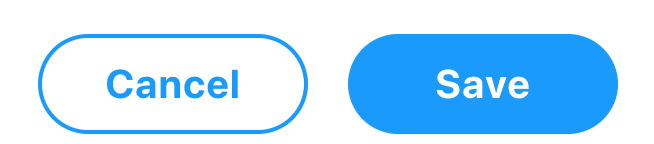
<br/>
These are what the BigButton looks like in white and blue.

### Props:

`onClick` : function -> pass in action to be done when button is pressed
`variant` : one of `'big-blue' 'big-white' 'small-blue' 'small white'` -> determines the looks of the button
`type` : string (optional) -> html button type

## DropDown

`import DropDown from '{path/to/this/dir}/library/DropDown/DropDown';`
`import DropDownGroup from '{path/to/this/dir}/library/DropDown/DropDownGroup';`
`import DropDownItem from '{path/to/this/dir}/library/DropDown/DropDownItem';`

A wrapper for html `select`

### Usage

```jsx
<DropDown
  onChange={this.handleChange}
  placeHolder="Select Item"
  value="this.state.value"
  hiddenPlaceholder
>
  <DropDownGroup label="group name">
    <DropDownItem value="item1-value"> Item 1 </DropDownItem>
    <DropDownItem value="item2-value"> Item 2 </DropDownItem>
    <DropDownItem value="item3-value"> Item 3 </DropDownItem>
  </DropDownGroup>
</Dropdown>
```

### Images / Preview

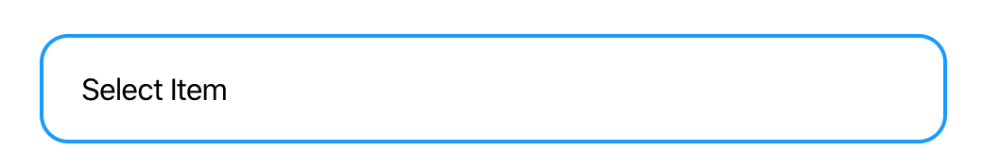
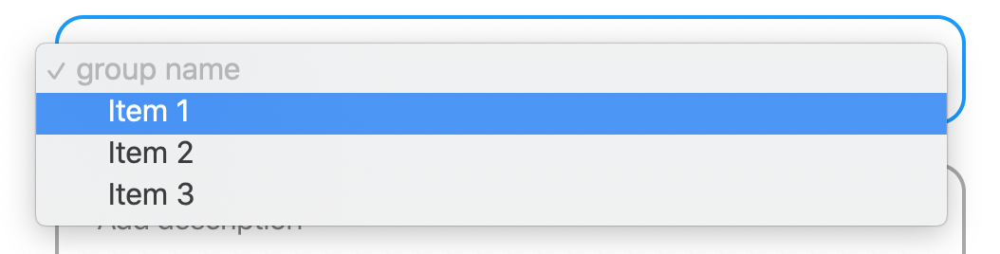
<br/>
These are what the BigButton looks like in white and blue.

### Props:

`onChange` : function -> pass in action to be done when new option is selected
`placeHolder` : string (optional) -> default value before item is selected
`value` :string -> same as value props for html select
`hiddenPlaceholder`: boolean -> whether or not to show placeholder as an option in the select list

## EventTitle

`import EventTitle from '{path/to/this/dir}/library/EventTitle';`
A wrapper for html `input` for large format header style text input

### Usage

```jsx
<EventTitle value={state.value} placeholder="Untitled event" onChange={this.handleChange} />
```

### Images / Preview


<br/>

Top: `EventTitle`
Bottom: `EventTitle` in focus

### Props:

`onChange` : function -> pass in action to be done when text is changed
`placeHolder` : string (optional) -> default value before input of text
`value` :string -> same as value props for html select

## Input

`import Input from '{path/to/this/dir}/library/Input';`
wrapper for html `input`

### Usage

```jsx
  <Input
    type="text"
    value={state.value}
    placeholder="Input Text"
    onChange={this.handleChange}
  />
  <Input
    type="textarea"
    value={state.value}
    placeholder="Input Long Text"
    onChange={this.handleChange}
  />
  <Input
    label="Select Date"
    type="datetime-local"
    value={state.value}
    onChange={this.handleChange}
  />
```

### Images / Preview

Input `type="text"`

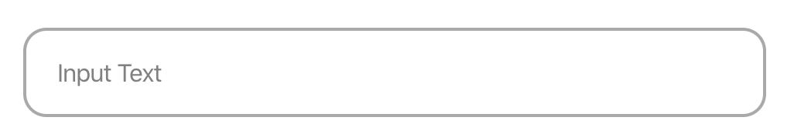<br/>

Input `type="textarea"`

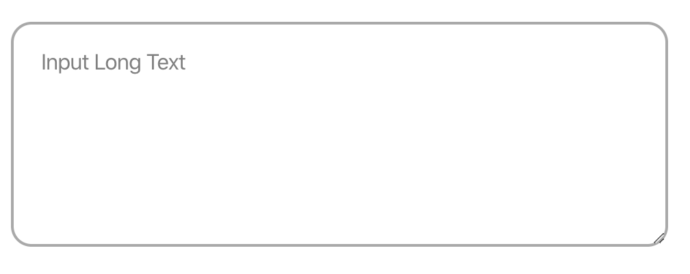<br/>

Input `type="datetime-local"` with `label="Select Date"`, top: before clicking, bottom: after clicking

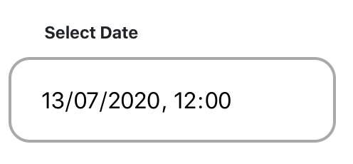
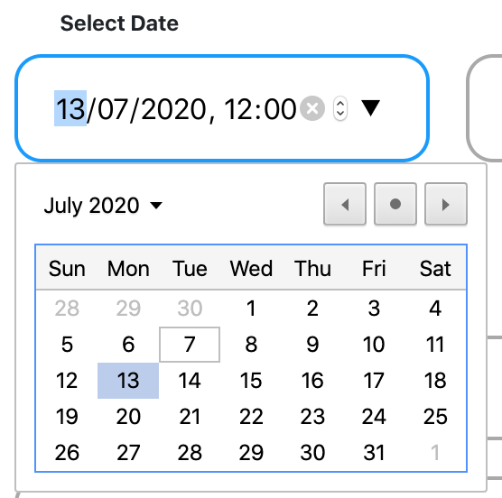

### Props:

`type` : `"text" "textarea" "datetime-local"` -> same as `type` for html `input`, but only these 3 are verified
`onChange` : function -> pass in action to be done when text is changed
`placeHolder` : string (optional) -> default value before input of text
`value` :string -> same as value props for html `input`
`label`: string -> label for the input value, valid for all input types

## RoundCheckBox

`import RoundCheckBox from '{path/to/this/dir}/library/RoundCheckBox';`
wrapper for html `input type="checkbox"`

### Usage

```jsx
<RoundCheckbox checked={state.checked} onChange={this.handleChange} label="RoundCheckBox" />
```

### Images / Preview

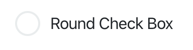
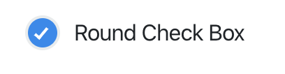

`RoundCheckBox` checked vs unchecked

### Props:

`checked` : boolean -> whether the box is checked or not
`onChange` : function -> pass in action to be done when text is changed
`label`: string -> label for the checkbox

## Tabs

`import Tabs from '{path/to/this/dir}/library/Tabs/Tabs';`
`import Tab from '{path/to/this/dir}/library/Tabs/Tab';`
Tab views. Currently not functional with complicated data flow, is fine for simple tabbed view of static content

### Usage

```jsx
<Tabs>
  <Tab label="Tab 1"> Tab 1 Content </Tab>
  <Tab label="Tab 2"> Tab 2 Content </Tab>
</Tabs>
```

### Images / Preview

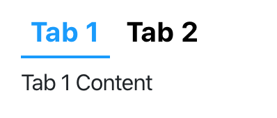
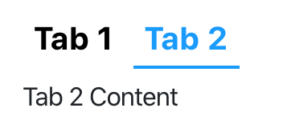

Toggling between the content of each tabs

### Props:

`label`: string -> label for each tabs
